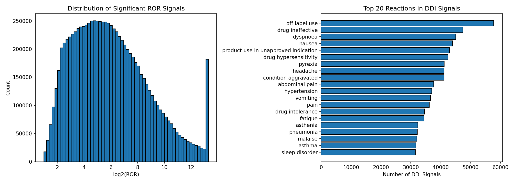
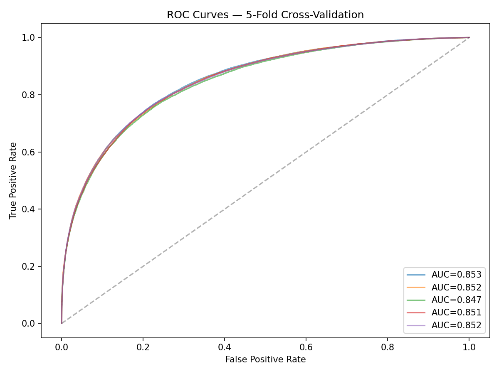
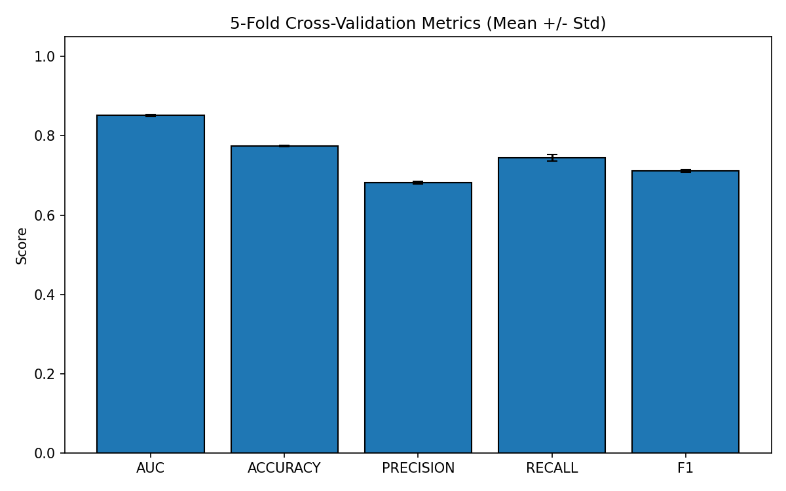
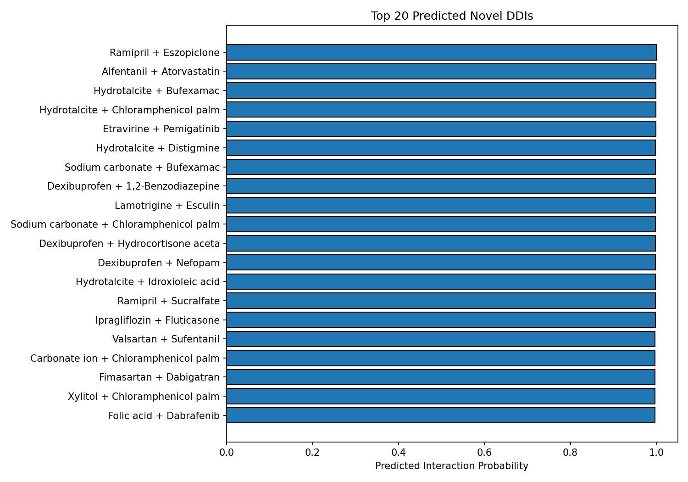
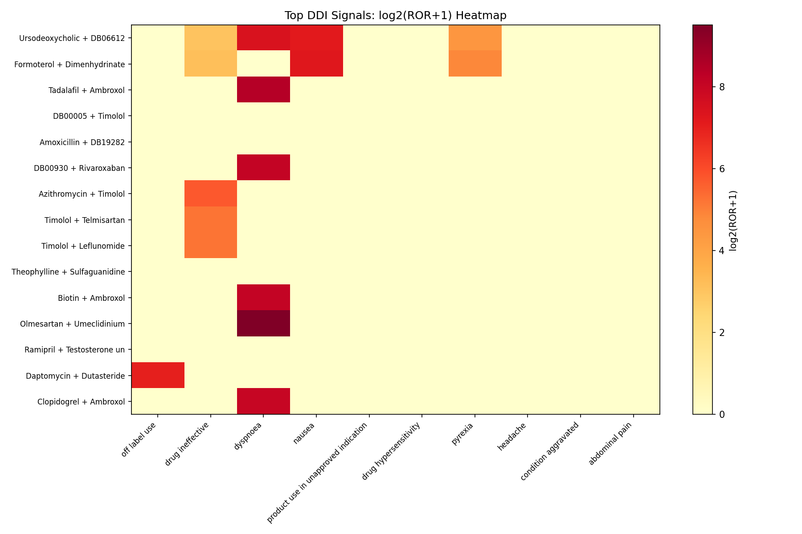

# Molecular Fingerprint DDI Prediction — Study Report

## Overview

This study applies a molecular fingerprint-based deep learning pipeline to
the FDA Adverse Event Reporting System (FAERS) to detect and predict
multi-drug interactions (DDIs). Drug names are canonicalized to DrugBank IDs
before pair generation, eliminating false signals from brand/generic name variants.

**Dataset**: FAERS (full database, all available years).

---

## Phase 1: Signal Detection

Pairwise disproportionality analysis (ROR) on DrugBank-canonicalized drug
pairs identified **8,962,225** statistically significant signals.
Contingency table filters: a >= 3, b >= 3, ROR > 2, 95% CI lower > 1.5.

**Labeled pairs**: 192,886 positive / 347,258 negative.

### Top 10 Strongest Signals

| Drug A | Drug B | Reaction | ROR | CI Low | Cases |
|---|---|---|---|---|---|
| Ursodeoxycholic acid | DB06612 | cftr gene mutation | 22970640.0 | 2290932.4 | 20 |
| Formoterol | Dimenhydrinate | cftr gene mutation | 17227975.0 | 1843729.5 | 20 |
| Tadalafil | Ambroxol | fractional exhaled nitric oxide increased | 16078986.0 | 4211101.5 | 112 |
| DB00005 | Timolol | vertebral end plate inflammation | 14930946.3 | 1456233.2 | 13 |
| Amoxicillin | DB19282 | amyloid arthropathy | 14547987.6 | 2845785.7 | 38 |
| DB00930 | Rivaroxaban | fractional exhaled nitric oxide increased | 12059236.0 | 3580046.4 | 112 |
| Timolol | Telmisartan | vertebral end plate inflammation | 11198206.5 | 1171151.3 | 13 |
| Azithromycin | Timolol | vertebral end plate inflammation | 11198206.5 | 1171151.3 | 13 |
| Timolol | Leflunomide | vertebral end plate inflammation | 11198206.5 | 1171151.3 | 13 |
| Theophylline | Sulfaguanidine | amyloid arthropathy | 10910987.5 | 2361746.4 | 38 |

---

## Phase 2: ECFP4 Fingerprints

DrugBank IDs mapped to 1024-bit ECFP4 molecular fingerprints via RDKit.
See `results/ddi_study/phase2_mapping_stats.txt` for statistics.

---

## Phase 3: Deep Neural Network

4-layer DNN (2048->512->256->128->1) with 5-fold stratified CV.

**Mean AUC**: 0.8511 +/- 0.0023

### Per-Fold Metrics

| Fold | AUC | Accuracy | Precision | Recall | F1 |
|---|---|---|---|---|---|
| 1 | 0.8534 | 0.7739 | 0.6784 | 0.7557 | 0.7150 |
| 2 | 0.8523 | 0.7728 | 0.6799 | 0.7455 | 0.7112 |
| 3 | 0.8472 | 0.7727 | 0.6844 | 0.7317 | 0.7073 |
| 4 | 0.8509 | 0.7743 | 0.6818 | 0.7475 | 0.7131 |
| 5 | 0.8517 | 0.7762 | 0.6869 | 0.7416 | 0.7132 |
| **Mean** | **0.8511** | **0.7740** | **0.6823** | **0.7444** | **0.7119** |

---

## Phase 4: Novel DDI Predictions

Scored unseen drug pairs (minimum 50 training-pair
exposure per drug). Deduplicated by DrugBank ID.

### Top 10 Predicted Novel DDIs

| Drug A | Drug B | Probability |
|---|---|---|
| Ramipril | Eszopiclone | 0.9996 |
| Alfentanil | Atorvastatin | 0.9994 |
| Hydrotalcite | Bufexamac | 0.9993 |
| Hydrotalcite | Chloramphenicol palmitate | 0.9991 |
| Etravirine | Pemigatinib | 0.9988 |
| Hydrotalcite | Distigmine | 0.9983 |
| Sodium carbonate | Bufexamac | 0.9981 |
| Dexibuprofen | 1,2-Benzodiazepine | 0.9980 |
| Lamotrigine | Esculin | 0.9979 |
| Sodium carbonate | Chloramphenicol palmitate | 0.9977 |

### Signal Heatmap

### Validation Against DrugBank

| k | Hits | Precision |
|---|---|---|
| 10 | 2 | 0.200 |
| 25 | 8 | 0.320 |
| 50 | 13 | 0.260 |
| 100 | 23 | 0.230 |
| 200 | 48 | 0.240 |
| 500 | 117 | 0.234 |

---

## Limitations

- FAERS is spontaneous reporting; does not establish causation.
- Drugs not in DrugBank are excluded from analysis.
- Model learns substructure-reporting correlations, not pharmacokinetic mechanisms.
- Minimum-exposure filter reduces false positives but may exclude rare-but-real DDIs.

## References

1. Schreier, T. et al. (2024). Integration of FAERS, DrugBank and SIDER
   for ML-based ADR Detection. *Datenbank-Spektrum*, 24, 233-242.
2. Zhang, X. et al. (2025). Identifying Drug Combinations Associated with
   Acute Kidney Injury. *Biomed J Sci & Tech Res*, 64(1).
3. Shen, Y. et al. (2020). Mining High-Order Drug Interaction Effects.
   *BMC Med Inform Decis Mak*, 20, 48.
