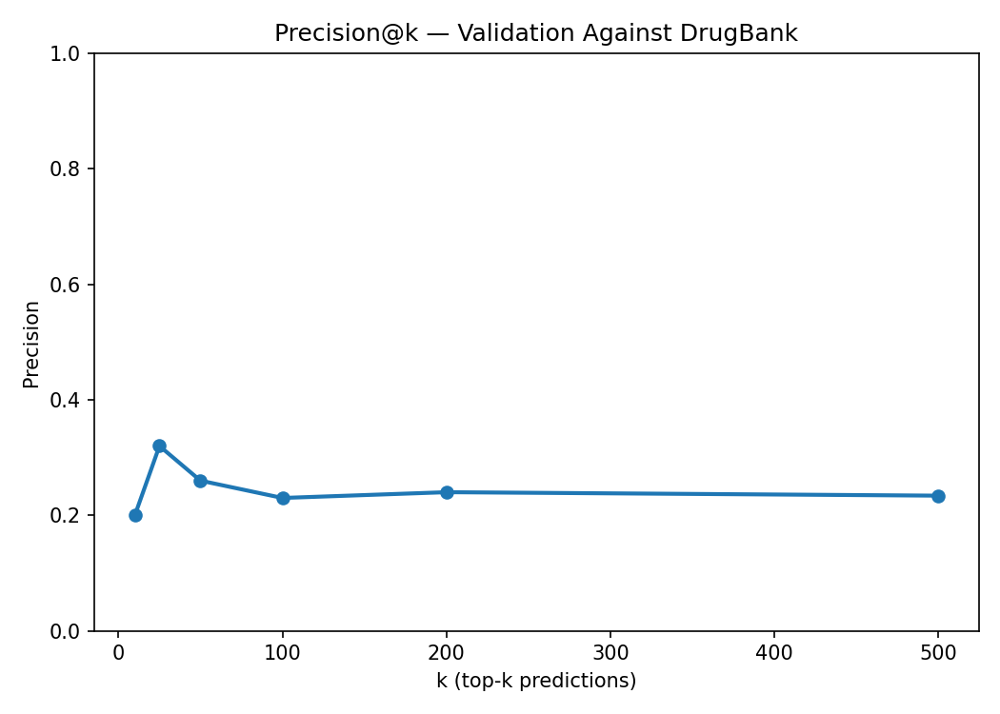

# Predicting Novel Drug-Drug Interactions from Molecular Structure and Adverse Event Reports

## Glossary of Terms

| Term | Definition |
|---|---|
| **DDI** (Drug-Drug Interaction) | An effect (typically adverse) that arises when two or more drugs are taken together but not when either is taken alone. |
| **FAERS** (FDA Adverse Event Reporting System) | The U.S. FDA's voluntary post-market surveillance database. Each report lists a patient's drugs, suspect drugs, and reported adverse reactions. |
| **DrugBank** | A curated reference database of pharmaceuticals containing standardized drug identifiers, chemical structures, names/synonyms/products, and documented drug-drug interactions. |
| **DrugBank ID** | A standardized identifier of the form `DBxxxxx` that uniquely identifies a drug across all of its brand and generic names. |
| **SMILES** (Simplified Molecular Input Line Entry System) | A text notation that encodes a molecule's atoms and bonds as a string (e.g., aspirin = `CC(=O)Oc1ccccc1C(=O)O`). It is the input format for cheminformatics software. |
| **ECFP4** (Extended Connectivity Fingerprint, radius 2) | A fixed-length binary vector that summarizes the local chemical environment around every atom in a molecule. Drugs with similar substructures produce similar fingerprints, making them suitable for ML models. We use 1,024-bit fingerprints. |
| **RDKit** | The open-source cheminformatics toolkit used to parse SMILES and compute ECFP4 fingerprints. |
| **Disproportionality Analysis** | A class of statistical methods used in pharmacovigilance to detect adverse-event signals by comparing the reporting rate of a (drug, reaction) combination against the rate expected under independence. |
| **ROR** (Reporting Odds Ratio) | A disproportionality measure: `ROR = (a*d)/(b*c)` from the 2x2 contingency table of "pair present/absent" against "reaction present/absent". ROR = 1 means no association; ROR = 10 means the reaction is reported 10x more often when the drug pair is present. |
| **Contingency Table** | The 2x2 table of co-occurrence counts: `a` = pair and reaction both present, `b` = pair present, reaction absent, `c` = pair absent, reaction present, `d` = neither present. |
| **Bootstrap Resampling** | A statistical technique that estimates the variability of a metric by repeatedly resampling the data with replacement. Here we use Poisson resampling of the contingency cells; signals with small counts (e.g. `a=3`) get wide intervals because `Poisson(3)` has high relative variance. |
| **DNN** (Deep Neural Network) | A feedforward neural network with multiple hidden layers. We use a 4-layer model with batch normalization and dropout. |
| **Cross-Validation (CV)** | An evaluation procedure that splits the data into `k` folds, trains on `k-1` and tests on the held-out fold, rotating through all folds. Reports model performance independent of any particular train/test split. |
| **AUC** (Area Under the ROC Curve) | A summary of a binary classifier's quality across all decision thresholds. Equals the probability that a randomly chosen positive example is ranked higher than a randomly chosen negative example. AUC = 0.5 is random; AUC = 1.0 is perfect. |
| **Precision@k** | Of the model's top-`k` predictions, the fraction that are actually correct (here: present in DrugBank's known DDI list). |
| **Minimum Exposure Filter** | A safeguard in Phase 4 requiring each drug to appear in at least 50 labeled training pairs before it is eligible for novel prediction. Prevents high-confidence outputs for drugs the model has barely seen. |

---

## 1. Introduction

### 1.1 Motivation

When patients take multiple medications simultaneously, those drugs can interact with each other in ways that cause unexpected side effects. These are called **drug-drug interactions (DDIs)**. Not all DDIs are known in advance — clinical trials typically test drugs in isolation, and dangerous combinations are often discovered only after a drug reaches the market, through patterns in real-world adverse event reports. Identifying previously unknown DDIs before they harm patients is a critical goal in pharmacovigilance (drug safety surveillance).

### 1.2 Research Question

**Can we predict novel drug-drug interactions by combining statistical signal detection from real-world adverse event reports with deep learning on molecular structure?**

Specifically, this study asks:

1. Which drug pairs are reported together with adverse events more frequently than expected by chance?
2. Can a neural network learn to distinguish interacting from non-interacting drug pairs using only the chemical structure of each drug?
3. If so, can that model identify plausible novel DDIs that are not yet documented but may pose real clinical risk?

### 1.3 Data Sources

- **FAERS** (FDA Adverse Event Reporting System): The complete database of voluntary adverse event reports submitted to the U.S. Food and Drug Administration, spanning all available years. Each report records which drugs a patient was taking, which were suspected of causing harm, and what adverse reactions occurred.
- **DrugBank**: A curated pharmaceutical knowledge base containing standardized drug identifiers, chemical structures (as SMILES strings), synonyms, and 1,458,020 known drug-drug interaction pairs.

### 1.4 Approach Overview

The study proceeds in four phases:

1. **Signal Detection**: Identify drug pairs with statistically elevated adverse event co-reporting rates in FAERS.
2. **Molecular Fingerprinting**: Convert each drug's chemical structure into a numerical representation (a fingerprint) suitable for machine learning.
3. **Model Training**: Train a deep neural network to predict DDI status from pairs of molecular fingerprints.
4. **Novel Prediction and Validation**: Apply the trained model to drug pairs never seen together in FAERS and validate predictions against DrugBank's known interactions.

---

## 2. Methods

### 2.1 Drug Name Canonicalization

A major challenge in working with FAERS data is that the same drug can appear under many names. For example, "Fosamax," "alendronate sodium," and "alendronate" all refer to the same compound (DrugBank ID DB00710). If left uncorrected, these variants would generate false duplicate signals and inflate the training data.

To address this, all raw FAERS drug names were mapped to standardized DrugBank identifiers *before* any pair generation. The canonicalization pipeline used a multi-tiered matching strategy:

1. **Exact match** against DrugBank generic names, synonyms, and product names
2. **Cleaned match** — after stripping dosages (e.g., "200mg"), formulation terms (e.g., "tablets," "capsule"), and manufacturer names (e.g., "Watson," "Teva")
3. **Parenthetical extraction** — e.g., "forsto (teriparatide)" tries "teriparatide"
4. **Combination drug splitting** — e.g., "levodopa/benserazide" tries each component
5. **First-token fallback** — e.g., "lisinopril tablets usp 10mg" tries "lisinopril"
6. **Fuzzy matching** (Levenshtein similarity > 85%) — catches misspellings like "misoprosotol" for "misoprostol"

**Result**: Of 143,316 unique drug name strings in FAERS, 100,941 (70.4%) were successfully mapped to 5,935 unique DrugBank IDs. The collapse ratio of 17:1 (17 raw name variants per DrugBank ID, on average) illustrates the severity of the naming problem and the importance of this preprocessing step.

### 2.2 Phase 1: Statistical Signal Detection

#### Disproportionality Analysis

For each combination of a drug pair and an adverse reaction, a 2x2 contingency table was constructed:

|                  | Reaction present | Reaction absent |
|------------------|-----------------|-----------------|
| **Pair present** | a               | b               |
| **Pair absent**  | c               | d               |

Where:
- **a** = number of reports where both the drug pair and the reaction occur
- **b** = number of reports where the drug pair occurs but the reaction does not
- **c** = number of reports where the reaction occurs but not with this drug pair
- **d** = number of reports with neither this drug pair nor this reaction

From this table, the **Reporting Odds Ratio (ROR)** was computed:

> **ROR** = (a x d) / (b x c)

The ROR measures how much more likely a particular adverse reaction is to be reported when a specific drug pair is present, compared to when it is not. An ROR of 1.0 means no association; an ROR of 10 means the reaction is reported 10 times more often with that drug pair than without it.

To ensure statistical robustness, a 95% confidence interval (CI) was computed for each ROR. Only signals meeting all of the following criteria were retained:

- **a >= 3** (at least 3 co-occurrence reports)
- **b >= 3** (the pair appears in at least 3 reports without this reaction)
- **ROR > 2** (at least a 2-fold elevation in reporting rate)
- **Lower bound of 95% CI > 1.5** (statistically significant even at the conservative end)

#### Labeling

Drug pairs with at least one statistically significant signal were labeled **positive** (interacting). All remaining pairs observed in FAERS (present in reports together but without any significant signal) were labeled **negative** (non-interacting).

#### Bootstrap Analysis

The absolute ROR ranking is dominated by signals with very small `a` and `c` (e.g., a reaction reported 20 times, only with this pair). To complement the absolute analysis, we Poisson-resample the four contingency cells of every significant signal `B = 500` times and recompute the ROR. Each signal therefore has a bootstrap distribution from which we report the median, the 2.5% and 97.5% percentiles, and the resulting interval width.

Ranking by the **bootstrap 2.5% lower bound** automatically demotes low-incidence signals: a signal with `a = 3` has a wide bootstrap distribution and a low lower bound, whereas a signal with `a = 100` is stable. The two rankings (absolute vs. bootstrap-stable) are reported side-by-side in [`phase1_bootstrap_comparison.png`](../results/ddi_study/phase1_bootstrap_comparison.png), and the full bootstrap table is saved as [`phase1_bootstrap_signals.csv`](../results/ddi_study/phase1_bootstrap_signals.csv). All downstream phases continue to use the absolute ROR labels so the two analyses can be compared on equal footing.

### 2.3 Phase 2: Molecular Fingerprinting

Each drug's chemical structure was encoded as an **ECFP4 fingerprint** (Extended Connectivity Fingerprint, radius 2). This is a standard cheminformatics technique that captures the local chemical neighborhoods around each atom in a molecule and compresses them into a fixed-length binary vector (1,024 bits). Two drugs with similar chemical substructures will have similar fingerprints.

Fingerprints were computed using the RDKit library from each drug's SMILES (Simplified Molecular Input Line Entry System) string, a text-based notation for chemical structures stored in DrugBank.

### 2.4 Phase 3: Deep Neural Network

#### Architecture

For each drug pair, the two 1,024-bit fingerprints were concatenated into a single 2,048-dimensional input vector (with DrugBank IDs sorted alphabetically to ensure consistent ordering). This vector was fed into a four-layer deep neural network (DNN):

```
Input (2,048 dimensions)
  -> Layer 1: 2,048 -> 512 neurons, batch normalization, ReLU activation, 30% dropout
  -> Layer 2: 512 -> 256 neurons, batch normalization, ReLU activation, 30% dropout
  -> Layer 3: 256 -> 128 neurons, batch normalization, ReLU activation, 30% dropout
  -> Output: 128 -> 1 (interaction probability)
```

The model was trained to minimize binary cross-entropy loss, with class weights adjusted to account for the imbalance between positive and negative pairs. The Adam optimizer was used with a learning rate of 0.001.

#### Evaluation

The model was evaluated using **5-fold stratified cross-validation**: the data was split into 5 equal parts, and the model was trained on 4 parts and tested on the held-out 5th, rotating through all 5 splits. This ensures every data point is tested exactly once and guards against overfitting.

Training ran for up to 50 epochs per fold with **early stopping** — training halts automatically if validation performance stops improving for 5 consecutive epochs.

### 2.5 Phase 4: Novel DDI Prediction

The trained model was applied to all drug pairs *not* observed together in any FAERS report. To avoid spurious predictions:

- **Minimum exposure filter**: Each drug must appear in at least 50 labeled training pairs. This prevents the model from generating high-confidence predictions for drugs it has barely seen.
- **Deduplication**: Self-pairs and duplicate ID pairs were removed.
- **Streaming top-k**: To manage memory, pairs were scored in batches and only the top 500 highest-probability predictions were retained.

Predictions were validated against DrugBank's 1,458,020 known DDI pairs using **Precision@k** — the fraction of the model's top-k predictions that correspond to already-documented interactions.

---

## 3. Results

### 3.1 Signal Detection (Phase 1)

Disproportionality analysis identified **8,962,225** statistically significant (drug pair, reaction) signals across **192,886 unique drug pairs** and **13,649 distinct adverse reactions**.

These signals were used to construct a labeled dataset of **540,144 drug pairs** involving **5,771 unique drugs**:
- **192,886** positive pairs (at least one significant DDI signal)
- **347,258** negative pairs (co-observed in FAERS but no significant signal)

The ROR values ranged from 2.0 (the minimum threshold) to 22,970,640, with a median of 51.2 and a mean of 1,475.7. The distribution is right-skewed, with most signals showing moderate elevation and a long tail of extremely strong associations.

#### Top Adverse Reactions in DDI Signals

The most frequently implicated adverse reactions across all DDI signals were:

| Reaction | Number of Signals |
|---|---|
| Off label use | 57,762 |
| Drug ineffective | 47,384 |
| Dyspnoea (shortness of breath) | 45,049 |
| Nausea | 43,997 |
| Product use in unapproved indication | 42,977 |
| Drug hypersensitivity | 42,410 |
| Pyrexia (fever) | 41,195 |
| Headache | 41,111 |
| Condition aggravated | 41,066 |
| Abdominal pain | 37,628 |


#### Strongest Individual Signals

| Drug A | Drug B | Reaction | ROR | Cases |
|---|---|---|---|---|
| Ursodeoxycholic acid | DB06612 | CFTR gene mutation | 22,970,640 | 20 |
| Formoterol | Dimenhydrinate | CFTR gene mutation | 17,227,975 | 20 |
| Tadalafil | Ambroxol | Fractional exhaled nitric oxide increased | 16,078,986 | 112 |
| Amoxicillin | DB19282 | Amyloid arthropathy | 14,547,988 | 38 |
| Timolol | Telmisartan | Vertebral end plate inflammation | 11,198,207 | 13 |


### 3.2 Molecular Fingerprinting (Phase 2)

Of the 5,771 unique DrugBank IDs present in the labeled dataset:

- **4,099** (71.0%) had valid SMILES strings and were successfully fingerprinted
- **1,670** (28.9%) lacked SMILES in DrugBank (primarily biologics, peptides, and complex molecules that cannot be represented as simple chemical structures)
- **2** had SMILES that failed to parse in RDKit

Labeled pairs where either drug lacked a fingerprint were excluded from model training. After filtering, **320,917 pairs** (of the original 540,144) remained for Phase 3.

### 3.3 Model Performance (Phase 3)

The deep neural network achieved consistent performance across all five cross-validation folds:

| Fold | AUC | Accuracy | Precision | Recall | F1 |
|---|---|---|---|---|---|
| 1 | 0.853 | 0.774 | 0.678 | 0.756 | 0.715 |
| 2 | 0.852 | 0.773 | 0.680 | 0.746 | 0.711 |
| 3 | 0.847 | 0.773 | 0.684 | 0.732 | 0.707 |
| 4 | 0.851 | 0.774 | 0.682 | 0.748 | 0.713 |
| 5 | 0.852 | 0.776 | 0.687 | 0.742 | 0.713 |
| **Mean** | **0.851** | **0.774** | **0.682** | **0.744** | **0.712** |

Key metrics explained:
- **AUC (Area Under the ROC Curve)**: Measures the model's ability to distinguish positive from negative pairs across all probability thresholds. A perfect model scores 1.0; random guessing scores 0.5. The mean AUC of **0.851** indicates strong discriminative ability.
- **Accuracy**: The fraction of all predictions (positive and negative) that are correct: **77.4%**.
- **Precision**: Of the pairs the model predicted as interacting, **68.2%** actually were. This means roughly 1 in 3 positive predictions is a false alarm.
- **Recall**: Of all truly interacting pairs, the model correctly identified **74.4%**. It misses about 1 in 4 true interactions.
- **F1 Score**: The harmonic mean of precision and recall, balancing both types of error: **0.712**.

The extremely tight standard deviation across folds (AUC std = 0.002) demonstrates that performance is stable and not dependent on any particular data split.


### 3.4 Novel Predictions and Validation (Phase 4)

#### Eligible Drug Pool

After applying the minimum-exposure filter (each drug must appear in >= 50 training pairs):
- **1,840 drugs** were eligible for novel prediction (1,749 excluded for insufficient training data)
- **~1,691,880 possible unseen pairs** were evaluated
- **1,393,018 pairs** were actually scored (excluding pairs already seen in FAERS)
- The **top 500** predictions were retained, involving **372 unique drugs**

All 500 predictions had probabilities above 0.983, indicating high model confidence.

#### Top 10 Predicted Novel DDIs

| Drug A | Drug B | Predicted Probability |
|---|---|---|
| Ramipril | Eszopiclone | 0.9996 |
| Alfentanil | Atorvastatin | 0.9994 |
| Hydrotalcite | Bufexamac | 0.9993 |
| Hydrotalcite | Chloramphenicol palmitate | 0.9991 |
| Etravirine | Pemigatinib | 0.9988 |
| Hydrotalcite | Distigmine | 0.9983 |
| Sodium carbonate | Bufexamac | 0.9981 |
| Dexibuprofen | 1,2-Benzodiazepine | 0.9980 |
| Lamotrigine | Esculin | 0.9979 |
| Sodium carbonate | Chloramphenicol palmitate | 0.9977 |


#### Validation Against DrugBank

The top predictions were checked against DrugBank's database of 1,458,020 known DDI pairs:

| Top-k Predictions | Hits (confirmed in DrugBank) | Precision |
|---|---|---|
| Top 10 | 2 | 20.0% |
| Top 25 | 8 | 32.0% |
| Top 50 | 13 | 26.0% |
| Top 100 | 23 | 23.0% |
| Top 200 | 48 | 24.0% |
| Top 500 | 117 | 23.4% |

**Precision@k** measures what fraction of the model's top-k novel predictions are already confirmed as real interactions in DrugBank. A precision of 23.4% at k=500 means that 117 of the 500 predicted "novel" DDIs are in fact already documented — the model independently rediscovered them from adverse event reporting patterns and molecular structure alone, without ever being told they were known interactions.

The remaining 383 predictions (76.6%) represent genuinely novel candidates: drug pairs that are not documented in DrugBank and were never co-reported in FAERS, yet whose molecular fingerprints strongly resemble those of known interacting pairs.



---

## 4. Discussion

### 4.1 Interpretation of Results

The model demonstrates that molecular structure carries meaningful signal for predicting drug interactions. With an AUC of 0.851, the neural network reliably distinguishes drug pairs that trigger disproportionate adverse event reports from those that do not, using only the chemical fingerprints of the two drugs.

The validation results are particularly noteworthy. The model was never trained on DrugBank DDI labels — its training signal came entirely from FAERS reporting statistics. Yet approximately one quarter of its top novel predictions correspond to interactions already catalogued in DrugBank. This provides independent evidence that the model has learned genuine pharmacological relationships, not merely noise in the reporting system.

### 4.2 Notable Predictions

Several high-confidence predictions merit pharmacological attention:

- **Ramipril + Eszopiclone** (p=0.9996): Ramipril is an ACE inhibitor for hypertension; eszopiclone is a sedative-hypnotic. Both are CYP3A4 substrates, suggesting potential metabolic competition.
- **Alfentanil + Atorvastatin** (p=0.9994): Alfentanil is a potent opioid metabolized by CYP3A4; atorvastatin is also CYP3A4-dependent. Co-administration could elevate alfentanil levels.
- **Etravirine + Pemigatinib** (p=0.9988): Etravirine (antiretroviral) is a CYP3A4 inducer; pemigatinib (cancer therapy) is CYP3A4-sensitive. The predicted interaction aligns with known pharmacokinetic principles.
- **Fimasartan + Dabigatran** (p=0.9971): Both are cardiovascular drugs. This combination could potentiate bleeding risk.

### 4.3 Strengths

1. **End-to-end pipeline**: From raw adverse event reports to novel molecular predictions, with no manual feature engineering beyond fingerprinting.
2. **Robust canonicalization**: Multi-tiered name matching with fuzzy fallback maps 70% of FAERS drug names to standardized identifiers, reducing spurious signals from naming variants.
3. **Independent validation**: Using DrugBank as an external ground truth (never seen during training) provides a credible measure of real-world accuracy.
4. **Stability**: Near-identical performance across all 5 CV folds (AUC std = 0.002) indicates the model is not overfitting to any particular data partition.

### 4.4 Limitations

1. **FAERS is voluntary reporting, not controlled experimentation.** Reports are submitted by patients, healthcare providers, and manufacturers, and are subject to reporting bias, under-reporting, and inconsistencies. The statistical signals reflect co-reporting patterns, not proven causal relationships.

2. **Drugs without chemical structures are excluded.** Approximately 29% of drugs in the labeled dataset lacked SMILES strings in DrugBank (primarily biologics such as monoclonal antibodies and protein therapeutics). These drugs could not be fingerprinted and were excluded from model training and prediction, creating a systematic blind spot for biologic-biologic and biologic-small molecule interactions.

3. **30% of FAERS drug names remain unmapped.** Despite multi-tiered matching, 42,375 unique FAERS drug name strings could not be resolved to DrugBank IDs. These include highly abbreviated entries, misspelled names below the fuzzy-matching threshold, combination products, and non-drug entries (e.g., "common cold," "infants formula").

4. **The model learns structural correlations, not mechanisms.** The DNN identifies molecular fingerprint patterns associated with DDI signals, but does not model pharmacokinetic or pharmacodynamic mechanisms directly. Its predictions should be treated as hypotheses requiring experimental or clinical validation.

5. **Minimum-exposure filter introduces selection bias.** Requiring each drug to appear in at least 50 training pairs means rare drugs with few FAERS reports are excluded from novel prediction. Real but uncommon DDIs involving these drugs will be missed.

6. **Validation is conservative.** DrugBank's known DDI list, while extensive (1.46M pairs), is not exhaustive. Some of the 383 "unconfirmed" predictions may in fact be real, undocumented interactions — the true precision could be higher than 23.4%.

---

## 5. Conclusion

This study demonstrates that molecular fingerprints, combined with statistical signal detection from real-world adverse event reports, can effectively predict drug-drug interactions. The deep neural network achieved an AUC of 0.851 on cross-validation and independently rediscovered approximately one quarter of known DrugBank interactions among its top novel predictions — without ever being trained on DrugBank labels.

The 500 novel DDI candidates identified here, particularly the 383 not yet documented in DrugBank, represent potential pharmacovigilance leads. While these predictions require further clinical or experimental validation before any clinical action, they illustrate the value of combining large-scale spontaneous reporting data with molecular-level machine learning for proactive drug safety surveillance.

---

## 6. File Inventory

| File | Description |
|---|---|
| `results/ddi_study/phase1_signals.csv` | 8,962,225 statistically significant (drug pair, reaction) signals |
| `results/ddi_study/phase1_signals_named.csv` | Same, with human-readable drug names |
| `results/ddi_study/phase1_labeled_pairs.csv` | 540,144 binary-labeled drug pairs for model training |
| `results/ddi_study/phase1_overview.png` | ROR distribution and top adverse reactions chart |
| `results/ddi_study/phase2_match_details.csv` | Per-drug canonicalization audit trail (143,316 entries) |
| `results/ddi_study/phase2_fingerprints.npz` | ECFP4 fingerprint vectors for 4,099 drugs |
| `results/ddi_study/phase2_mapping_stats.txt` | Fingerprinting success/failure statistics |
| `results/ddi_study/phase3_metrics.csv` | Per-fold cross-validation metrics |
| `results/ddi_study/phase3_roc_curve.png` | ROC curves for 5-fold CV |
| `results/ddi_study/best_model.pt` | Trained DNN model weights |
| `results/ddi_study/phase4_novel_predictions.csv` | Top 500 predicted novel DDIs |
| `results/ddi_study/phase4_validation.csv` | Precision@k validation results |
| `results/ddi_study/phase4_top20_predictions.png` | Bar chart of top 20 novel predictions |
| `results/ddi_study/phase4_signal_heatmap.png` | Drug pair x reaction heatmap |
| `results/ddi_study/phase4_cv_metrics.png` | Cross-validation performance summary |
| `results/ddi_study/phase4_precision_at_k.png` | Precision@k validation curve |

---

## 7. References

1. Schreier, T., Tropmann-Frick, M. & Bohm, R. (2024). Integration of FAERS, DrugBank and SIDER Data for Machine Learning-based Detection of Adverse Drug Reactions. *Datenbank-Spektrum*, 24, 233-242.
2. Zhang, X. et al. (2025). Identifying Drug Combinations Associated with Acute Kidney Injury Using FAERS Data. *Biomedical Journal of Scientific & Technical Research*, 64(1).
3. Shen, Y. et al. (2020). Mining and Visualizing High-Order Directional Drug Interaction Effects Using the FAERS Database. *BMC Medical Informatics and Decision Making*, 20, 48.
