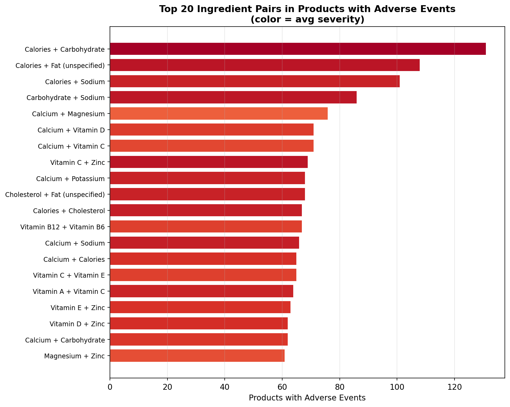
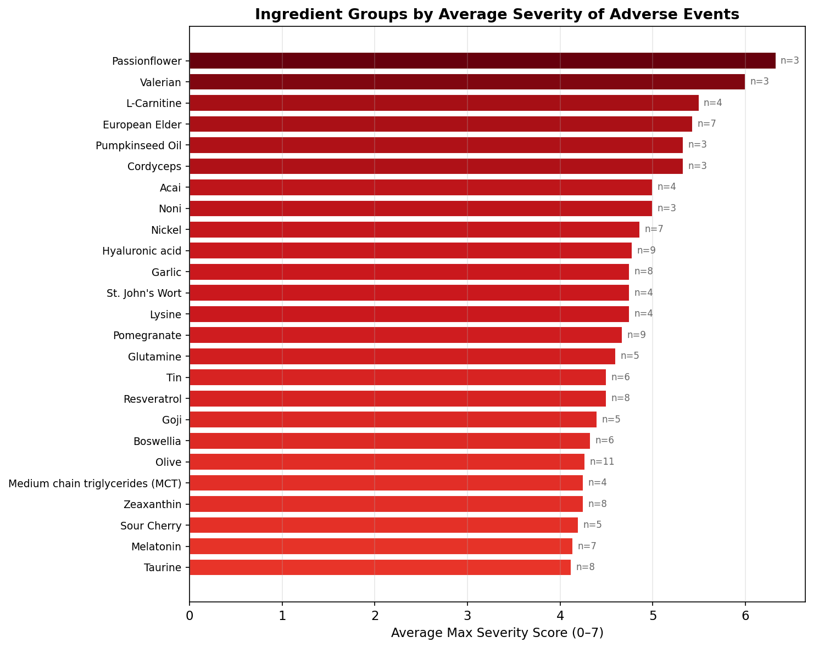

# HFCS Adverse Event Analysis — EDA Findings & Proposed Next Steps

## 1. Dataset Overview

After joining the FDA Human Food Complaint System (HFCS) adverse event reports to our Amazon–DSLD merged dataset, we have:

- **1,395 unique supplement products**
- **664 products (47.6%)** matched to at least one HFCS adverse event report
- **1,647 total adverse event reports** across those products
- **5,681 individual reaction occurrences** spanning **994 unique reaction types**
- Severity ranges from minor (ER visits) to death, with **hospitalization** as the most common max severity outcome

---

## 2. Key EDA Findings

### 2.1 Ingredient Pairs Most Associated with Adverse Events

This chart shows the 20 most frequent ingredient-group pairs found in products with adverse event reports, colored by average severity score.

**Key takeaways:**

- **Calories + Carbohydrate** is the most frequent pair (131 products), but this largely reflects that complex multi-ingredient products (protein powders, meal replacements) tend to list these. Their top reactions are GI-related: diarrhea, vomiting, abdominal pain.
- **Calcium + Magnesium** (76 products) and **Calcium + Vitamin D** (71 products) stand out among the vitamin/mineral combinations. These are extremely common supplement stacks, so frequency alone isn't alarming — but the associated reactions (diarrhea, vomiting, upper abdominal pain) suggest GI tolerability issues with mineral combinations.
- **Vitamin C + Zinc** (69 products) appears frequently with diarrhea and upper abdominal pain — notable because this is one of the most popular immune-support combinations on Amazon.
- **Vitamin B12 + Vitamin B6** (66 products) is a common pairing in B-complex supplements, showing up with moderate severity. This warrants further investigation into whether B-vitamin combinations carry interaction risks.
- The **color gradient** (darker = higher severity) shows that simpler mineral pairs like Calcium + Magnesium tend to have lower severity, while the nutritional-macro pairs (Calories, Fat, Sodium) skew higher, possibly because those products are consumed in larger quantities.

### 2.2 Severity by Ingredient Group

This chart ranks ingredient groups by the average max severity score (0–7) of adverse events reported for products containing that ingredient, with the sample size (n) shown.

**Key takeaways:**

- **Botanicals dominate the high-severity end.** Passionflower (avg 6.33, n=3), Valerian (6.0, n=3), and European Elder (5.43, n=7) all have average severities above 5 (hospitalization-level). These are herbal ingredients with known pharmacological activity, and the data suggests their adverse events tend to be serious when they occur.
- **L-Carnitine** (avg 5.5, n=4) is a notable non-botanical at the top. Its top reactions include chest discomfort, dyspnoea, and nausea — consistent with cardiovascular side effects reported in clinical literature.
- **Nickel** (avg 4.86, n=7) stands out as a mineral with high severity, associated with choking and dysphagia — likely related to physical pill/capsule issues rather than chemical toxicity.
- **100% hospitalization rate** for Passionflower, Valerian, L-Carnitine, European Elder, Pumpkinseed Oil, and Cordyceps — every adverse event report for products containing these ingredients involved hospitalization.
- Common vitamins and minerals (Vitamin C, Calcium, Zinc, Magnesium) appear further down the list with lower severity scores, consistent with their well-established safety profiles.

### 2.3 Statistically Significant Ingredient → Reaction Associations

Our chi-square analysis found **29 statistically significant associations** (p < 0.05) between ingredient groups and specific adverse reactions. The top 5 by lift:

| Ingredient Group | Reaction | Lift | p-value |
|---|---|---|---|
| Iodine | Choking | 3.0x | 0.009 |
| Vitamin D | Foreign body | 2.7x | 0.013 |
| Folate | Upper abdominal pain | 2.7x | 0.0001 |
| Vitamin B6 | Choking | 2.7x | 0.004 |
| Riboflavin | Choking | 2.6x | 0.022 |

Lift > 1 means the association occurs more often than expected by chance. A lift of 3.0 means products containing Iodine are 3x more likely to have choking reports than a random product. The Folate → upper abdominal pain association is the most statistically robust (p = 0.0001).

### 2.4 Additional Findings

- **Product type:** Single Vitamin/Mineral products have the highest adverse event rate (~68%), followed by Multi-Vitamin/Mineral (MVM) at ~58%.
- **Supplement form:** Tablets/Pills have the highest adverse event rate (~60%), which likely explains the high prevalence of choking and dysphagia in the reaction data.
- **Ingredient complexity:** Products with 21+ ingredients have the highest adverse event rate (~63%), but products with only 2–3 ingredients have the highest average severity — suggesting that simple, concentrated formulas may carry more intense risk per ingredient.
- **Ratings disconnect:** There is **no significant difference** (Mann-Whitney p = 0.18) in Amazon average ratings between products with and without adverse events. Consumers are not reflecting safety signals in their star ratings.

---

## 3. Proposed Next Steps

### Study 3: Severity Prediction Model

**Goal:** Build a model that predicts how severe a product's adverse events will be, based on its ingredient profile.

**Approach:**
- **Target:** Ordinal severity tiers — Low (score 0–2), Medium (3–4), High (5–7)
- **Features:** One-hot encoded ingredient groups (~190 features), ingredient count, product type, supplement form, and ingredient category (vitamin/mineral/botanical/amino acid)
- **Models:** CNN (reusing our existing architecture) and Gradient Boosting (XGBoost) for comparison. XGBoost provides feature importances showing which ingredients drive severity predictions.
- **Evaluation:** Classification report (precision, recall, F1 per severity tier), confusion matrix, and ranked feature importance chart

**Why it matters:** The EDA shows a clear pattern — botanicals and certain minerals cluster at the high-severity end. A predictive model would formalize this into a tool that can flag high-risk ingredient profiles before products reach consumers.

### Study 4: Association Rule Mining for Ingredient Combinations

**Goal:** Discover which specific ingredient *combinations* (2-way, 3-way, 4-way) are disproportionately associated with specific adverse reactions — going beyond single-ingredient analysis.

**Approach:**
- **Algorithm:** FP-Growth (from `mlxtend` library) on the 664 products with HFCS data
- **Transaction format:** Each product's ingredient groups + its reported reactions (prefixed with `reaction:`) form one transaction
- **Parameters:** Minimum support ~3–5%, filter rules to ingredient antecedents → reaction consequents
- **Output:** Ranked rules by lift and confidence, e.g.: `{Calcium, Vitamin D, Magnesium} → {choking}  lift=2.3, confidence=45%`

**Why it matters:** Single-ingredient analysis (Study 3 / EDA heatmap) can't capture interaction effects. For example, Iodine shows a 3.0x lift for choking, but the real driver might be Iodine + Selenium together. Association rules surface these multi-ingredient interactions, which are critical for supplement safety — most supplements contain multiple active ingredients.

**Key questions to answer:**
- Do certain ingredient combinations have elevated risk beyond what individual ingredients predict?
- Are there "safe" combinations where co-occurring ingredients reduce severity?
- Which 3-way or 4-way combinations appear in hospitalization-level events specifically?

### Capstone Deliverable: Ingredient Safety Lookup Interface

**Goal:** Build a consumer-facing tool (Streamlit web app) where users enter supplement ingredients and receive an adverse event risk profile.

**How it works:**
1. User types ingredient names (e.g., "Vitamin D, Calcium, Magnesium") with autocomplete
2. System maps inputs to DSLD ingredient groups
3. Looks up each ingredient's adverse event profile from precomputed tables (EDA outputs)
4. Checks ingredient combinations against association rules (Study 4 output)
5. Runs the severity prediction model (Study 3) on the combination
6. Displays: top reported reactions, severity risk level (green/yellow/red), hospitalization rate, and how the combination compares to individual ingredients

**Features:**
- Color-coded severity gauge
- Transparency: shows actual FDA report counts behind each finding
- Compare mode: enter two products' ingredient lists side by side
- Backed by real data (HFCS reports + DSLD labels), not opinions

**Why it matters:** Our EDA showed that Amazon ratings do NOT reflect adverse event risk (p = 0.18). Consumers have no easy way to assess supplement safety before purchasing. This tool bridges that gap by making FDA adverse event data accessible and actionable at the point of purchase.

---

## 4. Timeline

| Week | Task |
|---|---|
| Current | EDA complete, CNN rating regression complete (negative result) |
| Next | Study 4 — Association rule mining (FP-Growth) |
| Next | Study 3 — Severity prediction model (CNN + XGBoost) |
| Following | Streamlit interface prototype |
| Final | Report, presentation, polish |
